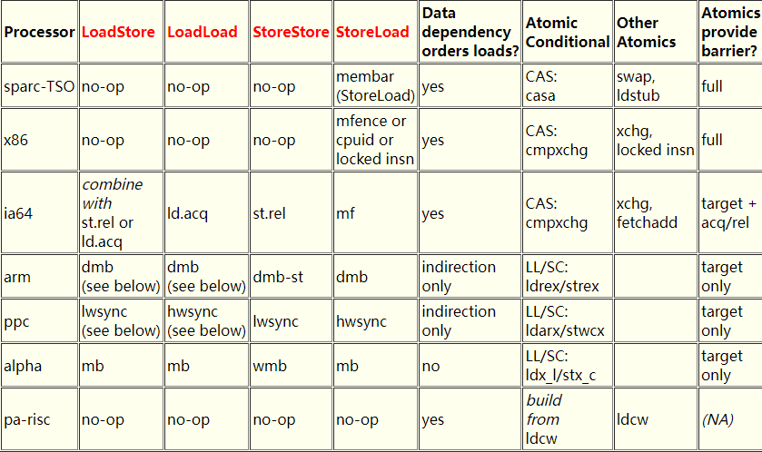
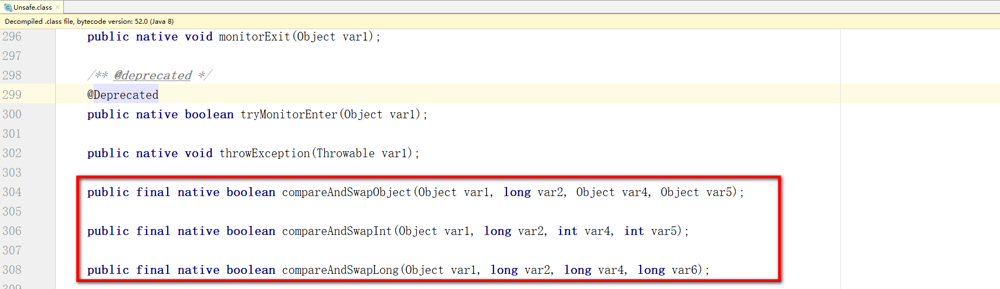
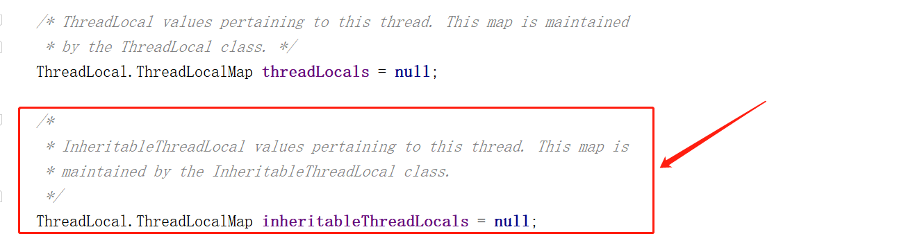
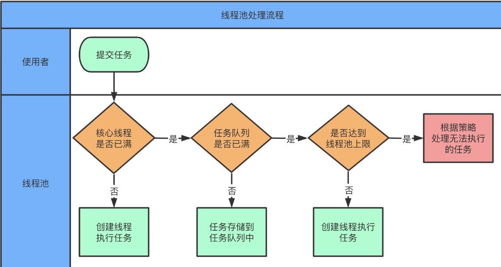
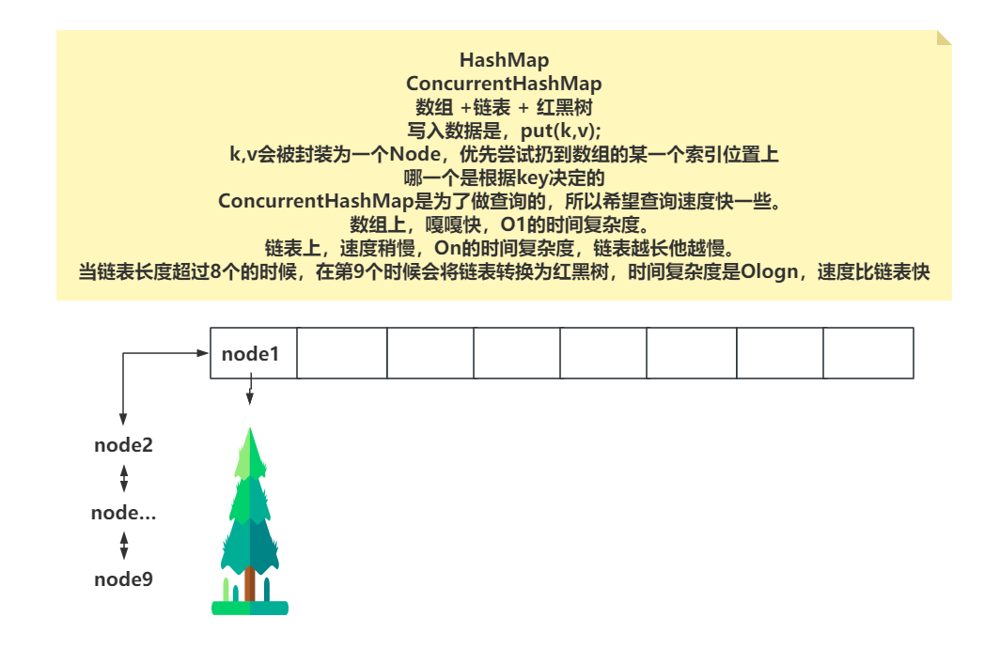

# 并发编程2024-1

## 并发编程2024-1

## 一、Java中为什么内存不可见？（高德）

**因为Java中的线程是由CPU去调度的，而CPU中包含了L1~L3的高速缓存，当CPU调度某个线程时，会将JVM中数据拉取到CPU高速缓存中。因为CPU现在基本都是多核的，所以其他CPU内核如果也获取了相同的数据，并且有写操作的发生，就会导致多个CPU内核之间的高速缓存中的数据不一致。**


## 二、什么是JMM？（天润融通）

**你了解Java的内存模型么？你要回答的是JMM。**

**如果问Java的内存结构，或者是JVM的内存结构，你再去说，堆栈方法区啥啥的……**

> JMM就是Java内存模型，因为在不同的CPU厂商下，CPU的实现机制都有一些不同，在内存和一些指令上都会存在一些差异。 所以JMM就是为了屏蔽掉硬件和操作系统带来的差异，放Java程序可以在不同的硬件和操作系统下，实现并发编程的 **原子性、可见性、禁止指令重排** 。

说白了，就是CPU内存和JVM内存之间的一个规范，这个规范可以将JVM的字节码指令转换为CPU能够识别的一些指令。

比如在×86的CPU中，原子性的保证要基于cmpxchg（Compare And Exchange）去实现，但是其他的CPU型号各自不同，在JMM中，就会将涉及到的CAS操作根据不同的CPU情况去翻译成不同的指令。

通过Doug Lea工作站里面的描述信息，可以看到，JMM可以帮你做到很多事情，其中重要的就是基于三大特性，对应不同的CPU做不同的实现。

https://gee.cs.oswego.edu/

如下图，除了可以看到Atomic的原子性的不同以外，还能看到内存屏障等内容。



## 三、Java里面有哪些锁，他们的区别是什么？（菜鸟）

Java中的锁可以分成乐观锁的实现和悲观锁的实现。

> 乐观锁和悲观锁是俩概念，不是单独指定的某个锁。
>
> Java中针对这俩种概念做了具体的落地。
>
> 乐观锁：认为在操作的时候，没有线程和我并发操作，正常的去写，但是如果有并发会失败，返回false，成功返回true。不会阻塞、等待，失败了就再试一次……。
>
> 悲观锁：认为在操作的时候，有线程和我并发操作。就需要先去尝试竞争锁资源，如果拿不到这个资源，就将线程挂起、阻塞等待。

乐观锁：CAS，在Java中是以Unsafe类中的native方法形式存在的，到了底层，就是之前说的CPU支持的原子操作的指令，比如×86下的cmpxchg。



悲观锁：synchronized，Lock锁。

## 四、乐观锁和悲观锁的区别？乐观锁一定好嘛？（菜鸟）

乐观锁不会让你的 **线程阻塞、挂起** ，可以让CPU一直调度执行竞争这个乐观锁，可以直到成功为止。

悲观锁会在竞争锁资源失败后，直接 **挂起、阻塞线程** ，等到锁资源释放后，才可能唤醒这个线程再去竞争锁资源。

核心区别就是 **是否会挂起你的线程** ，因为挂起线程这个操作，线程在用户态时不能这么做，需要从用户态转换到内核态，让OS操作系统去唤醒挂起的线程，这个用户态和内核态的切换就比较耗时。

这么看乐观锁相对悲观锁有一定的优势，但是也不是所有场景都ok。

如果竞争很激烈，导致乐观锁一直失败，那CPU就需要一直去调度他，但是又一直失败，就会有点浪费CPU的资源了。会导致CPU占用率飙高…………

在操作系统下，线程就一个阻塞状态BLOCKED，Java中为了更好的排查问题，给线程提供了三种阻塞的状态，BLOCKED，WAITING，TIMED_WAITING……

## 五、CAS到底最后加没加锁，有哪些用的地方？（猿辅导）

**CAS到底最后加没加锁：**

如果是在Java层面，他没有涉及到锁的情况，因为他不涉及线程的挂起和唤醒操作。可以认为是无锁操作。

但是CAS在CPU内部是基于cmpxchg指令去玩的，而且CPU也是多核的。那么在多个核心都去对一个变量进行CAS操作时，×86的CPU中，会添加 **lock前缀指令** ，可能会基于缓存行锁，或者是基于总线锁，只让一个CPU内核执行这个CAS操作。

**有哪些用的地方：**

一般在平时开发的时候，99.999999%用不到，除非你开发一些中间件，框架之类的，可能会涉及到。一般看到的都是在JUC包下的一个并发工具里会涉及到。 比如ReentrantLock，synchronized，ThreadPoolExecutor，CountDownLatch…………

## 六、Java中锁的底层实现？（天润融通）

1、**可以聊CAS，一般到了CPU的cmpxchg指令就到头了。**

2、**可以聊synchronized：**

* 聊对象头里的MarkWord，去聊锁升级，无锁、偏向锁、轻量级锁、重量级锁……

3、**可以聊Lock锁：**

* 聊AQS！

关于synchronized和Lock锁的细节，看2024金三银四突击班里的并发编程2

https://www.mashibing.com/live/2583


## 七、为什么HashMap的k-v允许为null，CHM不允许k-v为null？（小米）

HashMap的设计之初，就是为了线程在局部使用的，不存在多线程操作的情况，所以存null与否都不影响当前线程自己的操作。

ConcurrentHashMap的设计就是为了在多线程的情况下去使用。

* **如果允许存储null，那么你在get时，获取到了一个null数据，到底是获取到了还是没获取到呢？**
* 其次这种多线程操作的情况下，null值必然有可能会发生空指针异常的问题。

## 八、hash冲突的话有几种解决方式？（小米）

**链地址法：** HashMap就玩的这种方式，基于key的hashCode和桶位置 - 1做运算，如果出现了相同位置，就形成一个链表挂在一起。在HashMap中，

因为桶位置一般不会超过16个bit位，所以做了一个高低位的^运算，让高位也参与到。（这个算是多次Hash的套路）

**多次Hash：** 这个就是针对一个内容，做多次hash运算。比如先hashCode，然后再crc16之类的，让数值不同。（布隆过滤器就可以采用这个方式）

**公共溢出区：** 将hash表分为基准表和溢出表，但凡出现了hash冲突，就将冲突的数据扔到溢出表里。

**开放定址法：** 有关键字key的哈希地址（i），出现冲突时，以这个地址（i）为基准，产生另一个hash地址（i2），若i2还有冲突，再次以i为基准，再找一个i3，直到找到不冲突的地址，将元素扔进去。

* 线性探测：顺序的往后面找哈希地址~~~比如0有冲突，那就看1，1再有，那就看2，2再有，那就看…………
* 二次（平方）探测：2,4,8…………这么找地址……
* 随机数：随机找…………

## 九、怎么用Runnable实现Callable的功能（菜鸟）

本质就是问的FutureTask。

Runnable和Callable的区别无非就是能否抛异常，是否可以返回一个结果。

可以很直观的看到Runnable和Callale在源码中的区别。

但是Callable如何执行的啊？？

Callable本质需要基于FutureTask去执行，而在FutureTask里，有一个成员变量outcome，任务执行过程的异常或者是返回结果，都会被封装到outcome中，放执行者需要结果时，get方法会返回outcome中存储的内容。

可以在实现Runnable接口时，也声明类似的成员变量，当run方法执行时，整个try-catch住，如果出现异常信息，就将异常封装到这个成员变量中。如果正常执行完，有结果需要返回，就将需要返回的结果扔到成员变量中。

如果你对FutureTask比较了解，你还可以再聊一下给任务追加一个状态，避免任务并发投递时，带来的并发问题。

## 十、ThreadLocal应用场景，key和value分别是什么（蚂蚁）

**ThreadLocal一般就是再同一个线程中做参数传递的。**

一般场景，比如 **事务的控制** ，需要Service和Mapper使用同一个Connection，那就可以基于ThreadLocal去做参数的传递。

再比如 **链路追踪** ，想记录当前线程的整条日志信息，也可以基于ThreadLocal存储traceID。

再比如在Filter中，从请求头里面获取到了 **Token** ，后期需要在Controller中使用，也可以基于ThreadLocal传递Token信息。

---

本质上，ThreadLocal他不存储数据，真正存储数据的是每个线程Thread对象中的ThreadLocalMap属性。

真正存储数据的容器是Thread类中的ThreadLocalMap。

**ThreadLocal是作为key的存在，value是你正常存储的数据。**

至于ThreadLocal的内存泄漏问题，这里就不展开说了……

看2024金三银四突击班里的**并发编程1**

https://www.mashibing.com/live/2583


## 十一、子线程如何获取父线程中的属性信息。（忘了）

**可以采用一些共享变量的方式，来做线程之间的数据传递……**

除此之外，Java中还提供的InheritableThreadLocal类，来实现这个操作。

这个InheritableThreadLocal就是在父线程创建子线程时，将父线程设置到InheritableThreadLocal中的数据直接迁移一份到子线程的InheritableThreadLocal中。

在创建子线程时，会执行Thread的init方法，在init方法中，默认就会做InheritableThreadLocal数据传递的逻辑，只要父线程中的InheritableThreadLocal里面有数据，就会做迁移操作。直接将父线程的inheritableThreadLocals中的数据一个一个的搬到子线程的inheritableThreadLocals里面。

inheritableThreadLocals就是ThreadLocalMap



# 并发编程2024-2

## 并发编程2024-2

## 一、Java中怎么唤醒一个阻塞的线程？（小红书）

唤醒线程的方式：

* interrupt……
* Unsafe.unpark……

首先，线程阻塞的方式，在Java中其实只有一种形式，就是Unsafe类中的park方法去挂起的。

只不过Java中针对这种阻塞的状态，细分了3种：

* BLOCKED：synchronized…………
* WAITING
* TIMED_WAITING

这三个状态，其实对于操作系统来说，没区别，Java中细分的目的是为了让咱们在排查问题时，可以更好的定位。

**Java线程在获取synchronized锁资源失败后，如果该线程执行了interrupt，那这个线程会被唤醒吗？**

答：synchronized加锁的核心逻辑都是在C++内部实现的，如果在基于synchronized挂起后，线程被执行了 **interrupt** ，在C++的代码中，会被唤醒，并且可以执行CAS尝试获取锁资源，但是一般情况下，拿不到就再次被挂起了。而在Java中能看到的效果就是，没有任何效果（没拿到锁）。

其他的类似WAITING和TIMED_WAITING必然也是可以唤醒的，只是根据后续工具的代码逻辑来决定是否能真正的唤醒到自己编写的业务代码中。

比如lock.lock方法，synchronized的阻塞形式，中断后不一定会回到你自己的业务代码中。

但是比如lock.lockInterruptibly，Thread.sleep()，等可以在中断后，抛出interrupt异常能看到效果。

## 二、多个任务，同时达到临界点，主线程执行，怎么实现（去哪）

首先这种方式很多。

* join……

  ```
  t1...
  t2...
  t3...
  主线程：
  t1.join();
  t2.join();
  t3.join();
  // 只要代码到这，代表t1、t2、t3就都完成了~~
  ```

* CountDownLatch……

  ```
  CountDownLatch latch = new CountDownLatch(3);
  t1……(() -> {逻辑代码…………   latch.countDown();})
  t2……(() -> {逻辑代码…………   latch.countDown();})
  t3……(() -> {逻辑代码…………   latch.countDown();})
  主线程：
  latch.await();
  // 只要代码到这，代表t1、t2、t3就都完成了~~
  ```

* FutureTask……

  ```
  FutureTask f1 = t1……
  FutureTask f2 = t2……
  FutureTask f3 = t3……
  主线程：
  f1.get();
  f2.get();
  f3.get();
  // 只要代码到这，代表t1、t2、t3就都完成了~~
  ```

* CompletableFuture

  ```
  CompletableFuture cf = CompletableFuture.allOf(t1,t2,t2);
  cf.join();
  // 只要代码到这，代表t1、t2、t3就都完成了~~
  ```

## 三、让20个线程同一时刻开始执行（昨儿大佬直播间聊到的）

首先，想让20个线程同一时刻开始执行，这个不现实…… 线程是CPU调度的，这个咱们没法控制，所以一般情况下，让线程极可能同一时刻就行……

**直接采用CyclicBarrier工具就可以实现，CyclicBarrier本身就是等待多个线程都到达位置，然后再统一的被唤醒。原理类似于一个计数器，每到位一个线程，就--，并且挂起这个线程。当这个计数器减到0的时候，会将所有的线程唤醒，继续执行后续的逻辑。**

扩展聊：

CyclicBarrier的底层是基于ReentrantLock实现的。你到位的线程会基于await挂起，并且丢到Condition单向链表中。等到计数器到0时，会基于signalAll的方法，将所有到位的线程一个一个的唤醒，每个唤醒的线程还需要到AQS的同步队列中获取锁资源，才能继续往下执行，所以他们是存在先后顺序的。

## 四、CountDownLatch和CyclicBarrier，分别作用于什么业务，哪个可以复用，为什么；（去哪）

CountDownLatch的应用场景：

> CountDownLatch最多的使用场景就是在等待多个线程操作都完成后，再让后续业务继续执行的业务中……
>
> 这么解释没毛病：但是推荐大家，在面试的过程中，这个点最好结合自己的项目去聊……你在哪家公司的哪个项目中的什么功能里，就涉及了………………

CyclicBarrier的应用场景：

> * 比如类似游戏中，玩王者荣耀，LOL等等，需要等待10个客户端都匹配到位，才能开始游戏，这个10个客户端才会开始加载游戏……
> * 比如一个旅游的APP，需要报团，这个团可能有时间限制，同时还有人数的限制，如果撇去时间，等到人数到达了阈值，才会触发后续的一些。
> * 电商拼团，PDD，至少2人成团…………

**哪个可以复用，为什么？**

其实这哥俩都有一个特点，都需要等待多个线程做了什么事情，才能往下继续。

* CountDownLatch是基于AQS中的state做计数，每完成一个任务，countDown方法执行后，会对state - 1，当state为0后，就会唤醒那些基于CountDownLatch执行await的线程。
* CyclicBarrier是自己搞了一个count属性，每当有一个线程到位 **（执行CyclicBarrier的await方法）** 之后，就会对count进行--操作。等到count计数到0后，依然会唤醒，可以优先触发一个任务，然后唤醒所有到位的线程。

CyclicBarrier是可以复用的。 他提供了一个reset的方法，在这个reset方法中，会将所有之前到位，和即将到位的线程全部唤醒结束，同时重置count计数器，清空当前CyclicBarrier，以便下次使用

## 五、线程池的执行过程？（美团）

所谓的执行过程，或者说是执行原理，任务投递后的处理优先级都是一个意思。

任务投递到线程池之后

* 如果当前线程池的线程个数，不满足你设定的核心线程数，那么就会创建核心线程去处理投递过来的任务。
* 如果线程个数等于了你设定的核心线程数，那么任务会尝试投递到工作队列中排队。
  * 工作队列有长度，如果工作队列的长度大于排队的任务数，任务会被正常的投递到工作队列。
* 工作队列中的任务数和现在排队的任务数一致，任务无法投递到工作队列，此时需要创建一个非核心线程来处理刚刚投递过来的任务。
  * 创建非核心线程时，还需要判断一下线程个数是否小于你设定的最大线程数，小于才会正常创建。
* 如果线程个数等于你设定的最大线程数，会执行拒绝策略。



## 六、为什么非核心优先执行投递的任务（美团）

首先，线程池的使用是为了提交任务给线程池，让线程池异步处理。

而在提交任务的这个过程中，其实是业务线程在执行的。

**希望业务线程提交任务的过程要尽可能的短一些，让业务线程尽快的执行后续的逻辑。**

如果让业务线程创建的非核心线程直接去处理提交过去的任务，速度相对是最快的一种形式。

如果让业务线程创建的非核心线程优先去拉取队列中最早投递的任务，然后业务线程再将任务投递到工作队列这种形式，就会让任务投递的过程变慢。

### 核心线程跟非核心线程有什么区别？

答：没区别，核心线程跟非核心线程只有在创建的时候会区分，因为他要根据核心与非核心来决定判断哪个参数。是判断核心线程数，还是最大线程数。 而在干活的时候，他俩都是普通线程。

线程池只关注数量，无论你创建的时候，走的是核心的逻辑，还是非核心的逻辑，我只看数量。即便创建的时候走的是核心线程的逻辑，但是根据线程个人情况，多了一个线程，到达了最大空闲时间，也会干掉这个核心线程。

**这7个参数，哪怕死记硬背，也要熟练的说出来！！！**

```java
    public ThreadPoolExecutor(int corePoolSize,      核心线程数
                              int maximumPoolSize,   最大线程数
                              long keepAliveTime,    最大摸鱼时间……
                              TimeUnit unit,         摸鱼时间单位。
                              BlockingQueue<Runnable> workQueue,   工作队列
                              ThreadFactory threadFactory,    线程工厂
                              RejectedExecutionHandler handler) {    拒绝策略……
```

### 可能会有面试官这么问：核心线程可以被回收吗？

那面试官想问的是这个属性：allowCoreThreadTimeOut

这个属性相当于把你设置的核心线程数的这个属性的效果直接砍掉。

正常指定核心线程数为2个的时候，线程池即便长时间没任务，也要保留2个工作线程

但是如果allowCoreThreadTimeOut设置为true了（默认为false），那么只要工作线程超过了最大空闲时间，我就把你干掉，一个不留！

## 七、（蚂蚁线程池连环问）

#### Java线程池，5核心、10最大、10队列，第6个任务来了是什么状态？

任务扔工作队列里~

#### 如果在第6个任务过来的时候，5个核心线程都已经空闲了呢？

一样扔队列……线程池只关注数量！

#### 第16个任务来了怎么处理？

创建非核心线程去处理这个第16个任务~

#### 第16个任务来了的时候，要是有核心线程空闲了呢？

如果这个空闲的线程，将工作队列中的10个任务，取走了一个，变为了9个，那任务扔队列。

如果空闲的线程还没来得及取走任务，投递时，队列长度依然为10，那还是创建非核心。

#### 队列满了以后执行队列的任务是从队列头 or 队尾取？

一般咱们的阻塞队列都是FIFO的，所以先进先出，从头取。

#### 核心线程和非核心线程执行结束后，谁先执行队列里的任务？

谁谁空闲了，并且去等待任务，谁先去执行队列里的任务。

#### 线程池中的工作线程在执行任务的过程中，如何取消任务的执行？

**研究过FutureTask的源码即可。**

原生的ThreadPoolExecutor在提交普通的Runnable任务时，是无法做到的。

需要提交FutureTask的任务，在任务的处理过程中，会存储是哪个线程在处理当前的任务。

这样咱们就可以获取到执行当前任务的线程对象执行他的interrupt方法。如果有中断的出口，那就结束了，但是如果没有中断的出口，那即便你中断了，任务也会执行完毕！

其次也可以在任务还没执行前，通过对任务提供状态的修饰，基于状态来阻止任务执行，


**notify是什么？。看完整版的课时16**


# 并发编程2024-3

## 并发编程2024-3

## 一、线程池参数，线程池参数怎么设置（菜鸟）

### 线程池参数：

> 核心线程数
>
> 最大线程数
>
> 最大空闲时间
>
> 空闲时间单位
>
> 工作队列
>
> 线程工厂
>
> 拒绝策略

### 线程池参数怎么设置：

面试的时候被问到了你要点到几个信息：

* 你上线的服务器的硬件配置如何（**你的生产环境是4C8G**）
  * CPU内核数
  * 内存大小
* 你线程池处理的任务情况
  * CPU密集
  * IO密集
  * 混合型（既有IO操作，又有CPU操作）

前面的信息点清楚后，直接说你线程池中的 **核心线程数** 设置的是多少，以及你的 **工作队列多长**

* 核心线程数与最大线程数保持一致！ 至于到底是多少，自己提前编一个数值，比如50，比如80，随你。直接聊出来。数值是你压测出来的，记住，一定是压测的，你最开始可以给一个预估的数值，但是最终结果是压测的，在你的测试环境压测，测试环境的硬件配置和生产环境一致！ **（有一个前提，如果你任务是混合型的，那50左右没问题，如果是CPU密集的，别太大，基本就是CPU内核数左右）**
* 工作队列用的啥，多长。工作就常用的就俩，要么你用 **ArrayBlockingQueue** ，要么用 **LinkedBlockingQueue** ，这里我推荐大家统一 **LinkedBlockingQueue** 。因为你们的领导说了， **LinkedBlockingQueue** 底层是链表，工作队列本身就是增删比较频繁的情况，所以直接让我们用的 **LinkedBlockingQueue** ，效率相对更好。
  * 至于长度：
    * 这里你要说清楚你们这个任务触发的并发情况，如果任务体量比较大，会造成内存占用率过大。
    * 任务的延迟时间允许的范围，如果队列太长，任务被处理时，最大的延迟时间能否接收。
  * 队列长度要直接说是多少，一般情况就是和核心线程的2倍左右，一般情况没问题。  **100长度，150长度，200长度~~**

## 二、一般就是你针对大致业务和Tomcat或者一些中间件的线程池如何配置的，然后在压测的时候，你都查看什么指标？（前几天一学员的）

> 一般聊压测要查看的指标时，方向贼多。最核心的几个：
>
> * **CPU占用率：**
>   * 其中IO密集的任务，很难让CPU的占用率提升太大，所以IO密集，不需要提太多CPU占用率问题
>   * 其次在混合型或者CPU密集的任务中，需要时刻关注CPU占用率的情况，一般只要不超过70%基本没啥问题，最好控制在50~60左右。
> * **内存资源：**
>   * 内存资源自然是线程本身也会占用，一般占用1M。而且任务的处理过程也需要占用额外的内存资源，并且在队列中排队的任务也是一个对象，他也占用内存资源。不能让内存资源占用过多，比如在峰值的情况下，50~60%左右就可以了。
> * 磁盘资源：这个一般不用太考虑，毕竟现在都是固态，速度是ok的。
> * 还需要查看任务的处理情况的指标：
>   * **吞吐量：** 单位时间内，处理任务的个数。（越大越好）   **500个/s**
>   * **RT响应时间：** 每个任务的平均处理速度。（越小越好）  **200ms**
> * 还需要查看 **GC的情况** ，如果任务体量比较大，如果新生代的内存不够充裕，可能会导致对象直接甩到老年代，或者新生态频繁的GC，就可能会导致FULL GC频繁的情况。**（比如说，出现了这个情况，可以将新生态的比例调大）**
> * **其他资源：** 比如你任务需要访问数据库（MySQL），必然需要Connection，访问其他服务。
> * 网络情况： 在访问三方服务时，他的延迟情况是如何的。网络延迟是否会受到影响。
> * 还有在这种长时间的压测环境下，系统能否正常的长时间稳定运行。
>
> 1、优先根据配置自己确认要一个预估的数值，然后开始压测，查看指标情况。
>
> 2、逐渐的调整并发的数值，以及线程池的参数，去查看这些性能指标。
>
> 3、如果在逐渐的调整数值后，依然无法得到你性能的要求。根据前面的指标，查看瓶颈在哪 ，做优化。
>
> 4、重复2~3操作，直到，达到你的性能要求…………、
>
> 拒绝策略，在压测的时候就要规避好。因为执行了拒绝策略，必然要做监控预警通知咱们，最好的情况记录日志信息，及时的解决。

## 三、CopyOnWrite 怎么保证线程安全，为什么这么做？（协程）

**写写互斥，写读、读写不互斥，读读也不互斥。**

CopyOnWrite系列的并发集合，是基于再写入操作前，需要先获取ReentrantLock，毕竟写写操作是互斥的，然后先将本地的数据复制一份，在复制的内容中去完成写操作，在写完之后，将复制的内容覆盖掉本地的原数据。

* 前面的ReentrantLock，可以让写写操作直接互斥，达到线程安全的目的。
* 为什么还要改个副本，在副本里写的，这样内存占用率不就是double了么~~
  * 因为还有读操作，CopyOnWrite为了提升读的性能，没有让读写之间出现互斥的操作。读和写是可以并行执行的。在有线程进行读操作时，直接读取本地的数据，写入的线程就正常的先去写到副本中。

在使用ArrayList这种线程不安全的集合时，如果需要声明到成员变量，多个线程都去访问的时候，并且读操作居多时，就应当上CopyOnWrite的系列。

## 四、ConcurrentHashMap在红黑树的读写并发会发生什么？（我问的）

扫盲的内容：



红黑树为了保证平衡，在写入数据时，可能会做旋转、变色的操作。

如果红黑树上的读写可以并行执行，那就造成读线程在遍历红黑树找数据时，因为写操作的旋转，从而没找到。但是数据其实是存在的，可能会有影响到你的业务。

如果真的发生了写线程正在写数据到红黑树，此时来了一个读线程，并不会让读线程阻塞等待，而是直接让读线程去双向链表（单向链表）中查询数据，虽然速度慢了一内内，但是查询会进行下去……

**读线程怎么知道是否有写线程正在红黑树里写数据呢？**

基于下面这个int类型的数值，作为一个锁标记

`int lockState;`

```java
00000000
在二进制中。
最低位是1，代表有写线程在里面写数据。
第二低位是1，代表有写线程排队等待读线程完毕，再去写。
第三低位往上不为0，就代表有读线程正在红黑树里读取数据。
```

如果写线程发现有读线程正在红黑树里找数据，那写线程需要等一会，基于park挂起~~~

## 五、有在项目中实际使用过ConcurrentHashMap吗？哪些场景会用到？（京东健康）

ConcurrentHashMap本质就是做缓存的！将一些热点数据甩到ConcurrentHashMap里，他的速度比Redis快。毕竟你找Redis要数据，还得走一个网络IO的成本，ConcurrentHashMap就是JVM内部的数据。

比如数据已经从MySQL同步到Redis里了，但是Redis的性能不达标，或者Redis节点本身压力就比较大。那咱们就可以将缓存前置到JVM缓存中，利用ConcurrentHashMap去存储。

但是这种方式存储，如果JVM节点是集群部署，那就必然会存在不一致的问题。

* 强行走强一致，让你的缓存的存在没啥意义。。。（不这么玩）
* 通过一些中间件，MQ，Zookeeper等都可以做大监听通知或者广播的效果，这种同步可能存在延迟，达到最终一致性。
* 将一些访问量特别频繁的数据，扔到JVM内存，就生存1s甚至更少，这样可以较少对Redis的压力……同时在短时间内，也能提升性能……

类似Nacos，Eureka这种注册中心，就用到了ConcurrentHashMap，将注册中心里的注册列表的所有服务信息拉取到本地的ConcurrentHashMap中。

Spring的三级缓存用的啥？？不也是ConcurrentHashMap么~~BeanDefinition

## 六、工作中的死锁怎么处理（京东健康）

面试的时候，记得聊到死锁，必聊四个点，就背！！！

**互斥条件，请求保持，不可剥夺，环路**………………

**互斥条件（一般玩的就是互斥锁！）**
每个资源只能被一个线程使用，不能被同时占用。这意味着如果有两个进程试图同时使用同一个资源，就会发生冲突。例如，如果两个进程同时尝试修改同一个文件的内容，就会导致数据混乱。互斥条件是死锁的必要条件之一，因为如果资源可以同时被多个进程使用，就不会出现死锁的情况。

**请求与保持条件（一个线程在持有一个锁资源时，需要再拿另一个资源，而且之前的锁资源不释放）**
一个线程需要获取新的资源才能继续执行，但已经占有的资源不能被释放。这意味着如果一个进程已经占有了某些资源，那么它还需要获取更多的资源才能继续执行。例如，如果一个进程已经占有了两个资源A和B，但它还需要一个资源C才能继续执行，而资源C已经被另一个进程占用，那么这个进程就会陷入死锁。

**不剥夺条件（锁资源只能自己释放，别人不能释放！）**
已经分配给进程的资源不能被强制剥夺。这意味着如果一个进程已经占有了某些资源，那么除非它自己释放，否则其他进程或系统不能强制剥夺这些资源。例如，如果一个进程已经占有了两个资源A和B，但系统强行剥夺了其中一个资源A，那么这个进程就会陷入死锁。

**环路等待条件（线程1持有A资源，同时要B资源，线程2只有B资源，同时想要A资源）**
多个进程形成一种头尾相接的环路，每个进程都占用了一些资源，但又都需要得到下一个未占用的资源。这意味着如果多个进程形成了一个环路，每个进程都等待下一个进程释放资源，那么这个环路上的所有进程都会陷入死锁。例如，有三个进程A、B、C，A需要资源1和资源2，B需要资源2和资源3，C需要资源3和资源1，那么A、B、C就会形成一个环路等待条件，导致所有进程陷入死锁。

**定位方式：**

> jstack：
>
> ```
> jps，查看具体的进行的pid
> jstack pid ,直接就会打印出死锁信息
> ```
>
> arthas：
>
> ```
> 需要你自己优先下载一个jar包。
> yum -y install wget
> wget https://alibaba.github.io/arthas/arthas-boot.jar
> 在有Java环境的情况下，直接
> java -jar arthas-boot.jar
> 跑起来后，会让你选择监控的JVM进程谁，写编号就成。
> 继续的命令，就help，或者看看官方文档
> ```

**解决方式：**

* 规避业务中出现环路等待锁的情况，这种业务的设计就存在问题。
* 不要走lock这种死等的方式，可以采用tryLock等待一小会，拿不到就拉到。

## 七、手撕多线程，三个线程轮流打印123/ijk，打印10次。（阿里一面手撕）

可以采用的方式很多，比如基于synchronized的wait和notify通知线程实现顺序打印。

甚至还能用ReentrantLock的公平锁去实现，但是这个不太稳定……

咱们花活，直接上Semaphore，我就写一种了~~~

```java
private Semaphore s1 = new Semaphore(0);
private Semaphore s2 = new Semaphore(0);
private Semaphore s3 = new Semaphore(0);

public void print123(){
	Thread t1 = new Thread(() -> {
		for(int i = 0;i < 10;i++){
			sout(1);
			s2.release();
			s1.acquire();

		}
	}); 
	Thread t2 = new Thread(() -> {
		for(int i = 0;i < 10;i++){
			s2.acquire();
			sout(2);
			s3.release();
		}
	}); 
	Thread t3 = new Thread(() -> {
		for(int i = 0;i < 10;i++){
			s3.acquire();
			sout(3);
			s1.release();
		}
	});
}
```
