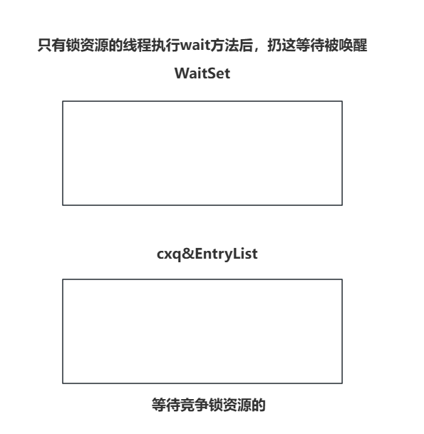
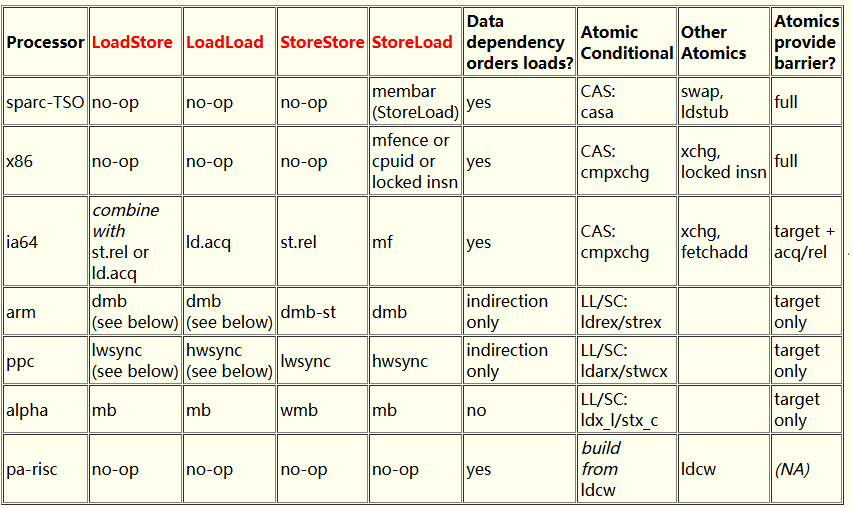

## 并发编程-2025

**所有问题都是不会就回家等通知！！！！！！！！**

## 1、sleep、wait的区别（猫眼）

> 这个是一个常识性的问题，一般是基于他引出更多的问题
>
> 从方法和功能的角度来聊。
>
> * sleep是Thread中的静态方法，目的是让执行这个方法的线程进入TIMED_WAITING，WAITING状态。
> * wait是Object中的一个普通方法，目的是让持有锁的线程释放锁资源并且进入到TIMED_WAITING，WAITING状态
>
> sleep是由线程执行Thread.sleep方法，而wait是由持有锁的线程执行锁对象.wait方法。
>
> sleep在进入阻塞状态时，不会释放锁资源（跟锁没关系）。 wait在进入阻塞状态时，会释放锁资源。

## 2、wait和notify做什么的，为什么他们是Object类中的方法（猫眼）

> 首先wait和notify都是和synchronized挂钩的。
>
> 第一点小扫盲一下synchronized一些小原理~
>
> 
>
> wait方法就是将持有锁的线程，封装为ObjectWaiter，扔到WaitSet中等待被唤醒。
>
> notify方法就是将WaitSet中等待被唤醒的线程扔到EntryList中等待竞争锁资源（被唤醒的线程，需要重新等待竞争锁资源）。notifyAll就是将WaitSet中等待池的所有线程都唤醒，都扔到EntryList中。
>
> ---
>
> **为什么他们是Object类中的方法？**
>
> 因为咱们在执行wait和notify或者是notifyAll方法时，本质都是在操作对象锁中的ObjectMonitor里提供的很多数据结构和一些API，这里需要对象锁中的ObjectMonitor的API，你不持有锁，没法调用它里面的API。。

## 3、线程安全的保证（致宇宁波）

> 这个是一个常识性的问题，一般是基于他引出更多锁
>
> 线程不安全的原因是多个线程并发操作临界资源导致的问题。
>
> 1、可以从临界资源方面规避，每个线程自己玩自己的数据就可以了，就不存在多线程并发操作的问题了，比如HashMap这种集合，就应当在方法内部去构建，不要构建成共享资源。
>
> 2、如果场景就是存在多个线程并发操作临界资源，那想保证线程安全，就需要用到锁。
>
> Ps：后面就要引出你最想聊的。Java中得几个常见锁，**CAS、synchronized、ReentrantLock、ReentrantReadWriteLock，StampedLock。（Redis分布式锁，最好聊Redisson）**
>
> **3、如果你项目中涉及到了用锁的点，你就可以展开你的项目去聊。**

## 4、自旋锁、CAS、乐观悲观（国人通、致宇宁波、仕硕科技、航天低空、爱奇艺）

> 当问到了乐观锁和悲观锁的时候，就从锁分类维度的展开聊。
>
> 乐观悲观：
>
> * 乐观：认为没有并发情况，直接动手！看成功失败！不阻塞线程。CAS
> * 悲观：认为必然有并发，先尝试拿锁资源，再动手，拿不到锁资源就阻塞线程。lock，synchronized
>
> 互斥共享：
>
> * 互斥：只能有一个线程同时持有一把锁。 synchronized，lock
> * 共享：同一时间，可以有多个线程持有一把锁，一般是针对读写锁的实现。ReentrantReadWriteLock，StampedLock。
>
> 重入非重入：同一个线程持有一把锁的时候，再次竞争这个锁资源，是可以直接获取的。
>
> **Ps：非重入锁在Java中只有线程池里的Worker对象是非重入的，但是这个Worker的锁不对外提供，是内部的一个机制。**
>
> 公平非公平：是否存在插队的情况，synchronized和lock锁默认都是非公平锁（其实不是真插队，是上来直接抢，抢到走人，抢不到还是乖乖的去排队）。公平锁就是锁被持有，或者有排队的，就直接排到最后面，不抢。
>
> **Ps：公平锁的实现在构建ReentrantLock对象时，有参构造里传入true即可。**
>
> ---
>
> **细聊一下自旋锁和CAS？**
>
> **自旋锁这个名词是synchronized内部的。在synchronized中有个轻量级锁的概念，他会多次的执行CAS去尝试获取锁资源，而这个多次CAS就被称为自旋锁。**
>
> 而CAS本质在Java中是一个方法，Unsafe类中的一个native方法。
>
> 本质是在oldValue和当前值一样的情况下，将olaValue修改为newValue
>
> ```java
> // CAS的本质是针对某个对象中的某个属性从oldValue修改为newValue
> var1：哪个对象？
> var2：属性在这个对象中的偏移量。
> var4：oldValue
> var5：newValue
> compareAndSwapObject(Object var1, long var2, Object var4, Object var5);
> ```
>
> CAS只是在修改一个属性时，确保线程安全，无法保证一段代码的线程安全。
>
> 同时compareAndSwapObject方法是native修饰的，他的本质是利用的CPU的指令来实现的，cmpxchg。
>
> **Compare And Exchange（cmpxchg）**
>
> ---
>
> **CAS的几个问题：**
>
> * ABA：在多线程并发的情况下，要修改的值，本来不符合预期，但是修改的时候，因为其他线程的操作，导致符合预期了，就直接修改了。不是咱想要的。解决的方式也很简单，额外加一个版本好即可。而且Java中已经提供了对应的工具类，AtomicStampedReference，提供了除了值之外的额外的版本号可以指定。
>   **Ps：ABA不一定是问题，就好比你的银行卡，你花了10块，又存了10块，之前钱没问题，就是ok的。具体看业务，比如刚才举例的二手车问题。**
> * 自旋次数过多：因为CAS不会挂起线程，可以一直执行，比如AtomicInteger，他的底层是一个do-while循环，一直CAS，直到成功为止，如果一直不成功，就会一直占用CPU资源，一直执行。。
> * 无法保证一段代码的原子性，想保证得封装，不过Java封装好了，synchronized，lock锁都是基于CAS实现的。

## 5、AQS（滴滴司乘、仕硕科技、元保）

> 1、解释一下什么是AQS（引出其他的JUC下的工具）
>
> AQS的本质就JUC包下的一个抽象类
>
> ```java
> package java.util.concurrent..;
> public abstract class AbstractQueuedSynchronizer ...{
> }
> ```
>
> AQS就是一个基础类，并没有具体的并发功能实现，是JUC包下的大多数的工具都是基于AQS实现的，比如：ThreadPoolExecutor，ReentrantLock，CountDownLatch，Semaphore……
>
> 2、聊一下AQS中的三个核心内容
>
> * state属性， **由volatile修饰，基于CAS修改** ，他是作为资源的int类型属性，比如CountDownLatch中他就是计数器中的内个数，ReentrantLock中他就是竞争锁修改的内个属性。。。。
> * 同步队列（双向链表），拿不到资源的线程需要排队等，就在这个同步队列里等。**（类比EntryList）**
> * 单向链表，一般是跟锁有关的，当持有锁的线程，执行了AQS提供的Condition里的await时，要扔到这个单向链表中挂起，等待被signal唤醒。**（类比WaitSet）**

## 6、sync和lock的区别（滴滴司乘）

> 1、~~单词不一样~~（面试别说。。）
>
> 2、synchronized是关键字，lock是一个类。
>
> 3、synchronized就同步方法，同步代码块的使用方式，lock需要调用API。
>
> 4、从性能的维度来说，他俩几乎没有什么区别。（在JDK1.6synchronized优化之后）
>
> 5、从功能丰富的角度来说，lock更灵活，功能更丰富。
>
> 6、比如synchronized会自动释放锁资源，lock锁必须确保unlock要执行，最好扔fianlly里。
>
> 7、synchronized竞争锁是基于C++的方式，利用CAS修改owner竞争锁，ReentrantLock是基于CAS修改state属性，从0改为1。
>
> **Ps：synchronized中的偏向锁在JDK15被废弃，20中被完全移除了，因为偏向锁撤销需要等待安全点，很耗时，他不但没法优化，反而会导致一定的性能下降，so，在JDK15被干掉了。。。**
>
> …………

## 7、lock，tryLock，lockInterruptibly的区别（滴滴司乘）

> 这几个方法都是ReentrantLock获取锁的方法。。。。
>
> lock：拿不到锁直接排队，即便排队时期被中断了（interrupt），依然会继续排队，死等，拿不到锁，就不走了！等到拿道锁，确认是否被中断过，如果中断过，就保留中断标记位。
>
> tryLock()：浅尝一下，就抢一次，抢到拿锁走人返回true，抢不到，返回false
>
> tryLock(timeout,unit)：浅尝timeout.unit时间，最多等待timeout.unit时间，拿到锁返回true，反之false。并且在等待过程中，如果被中断，会抛出InterruptedException。
>
> lockInterruptibly：拿不到锁直接排队，要么拿锁走人，要么被中断抛出InterruptedException。

## 8、synchronized、锁升级（致宇宁波）

> synchronized常问就几个，锁膨胀（锁粗化）、锁消除、锁升级，基本就这些问题，你如果想深入的去聊synchronized，卷一波，
>
> **锁膨胀：** 如果设计到了循环内加锁，JIT可能会将加锁的代码膨胀到循环外，避免频繁的加锁，释放锁浪费资源。
>
> ```java
> while(){
>     synchronized(){
>
>     }
> }
> // 膨胀
> synchronized(){
>     while(){
>     }
> }
> ```
>
> **锁消除：** 在没有锁竞争的时候，你加个synchronized，跟没加一样。（看JIT）
>
> **锁升级：**
>
> * 无锁：在偏向锁延迟中，new出来的对象都是无锁状态。  （没有线程竞争呢还。）
> * 匿名偏向锁：在偏向锁延迟之后，new出来的对象都是匿名偏向锁。  （没有线程竞争呢还。）
> * 偏向锁：短时间内，就一个线程反复的获取这个锁，没有竞争，此时这个锁的状态就是偏向锁。
> * 轻量级锁：在偏向锁时，出现了锁竞争，此时就会升级为轻量级锁，默认会执行10次CAS，去尝试获取锁资源。10次会变化，因为用的是自适应自旋锁，如果上次自旋成功，下次自旋次数会增加。
> * 重量级锁：当轻量级锁的状态自旋后，没拿到锁资源，升级为重量级锁，重量级锁的状态下依然会执行多次CAS，拿不到锁资源才会挂起线程。

## 9、JMM（仕硕科技）

> **每次突击班，我基本都会说JMM，而且每次都要说一句。**
>
> **别这么写技术栈： 熟练掌握JVM，JMM，了解GC回收。。。  JMM属于并发编程，别放这。。。。。**
>
> **如果面试被问到了Java的内存模型，你要聊JMM，如果是问了Java的内存结构或者是JVM的内存模型，你去聊堆、栈、方法区。。**
>
> **因为咱们程序是由线程去执行指令的，线程是由CPU去调度的。但是CPU由于厂商不同，型号不同，在做一些并发操作时，他去解决原子性，可见性，有序性时，他们提供的指令或者是解决方案可能各有不同，JMM的目的，就是为了解决这个硬件，甚至包括不同的操作系统带来的一些差异化的影响。从而实现Java的跨平台的并发编程能力。**
>
> 比如有序性，在不用的CPU型号中，解决问题的方式就不一样，JMM就可以去调用不同型号CPU的解决方式。
>
> 

## 10、volatile的作用（爱奇艺）

> volatile只能解决可见和有序，他跟原子性没关系，原子性最底层的基本就是CAS了。
>
> **1、可见性问题怎么发生的。**
>
> 因为CPU在调度线程时，为了加快处理速度，会将一些从JVM中获取的数据扔到CPU缓存中，下次操作就直接从CPU缓存中拿，直接使用。但是CPU是多核的，L1和L2在多个CPU核心之间是相互隔离开的。
>
> 所以多个内核之间的高速缓存会存在数据不一致的问题。所以CPU自身也有解决方案，一般CPU的厂商会基于MESI协议，实现多个高速缓存之间的一致性。但是因为CPU的核心是性能，MESI会影响性能。
>
> So，很多厂商就对MESI多了很多的优化，比如Store Buffer ，InvalidateQueue，这些都会导致MESI协议会延迟触发，导致虽然有这个机制，但是依然存在数据不一致的问题。
>
> **2、volatile怎么解决的可见性**
>
> volatile在底层针对被修饰的属性操作时，会追加 **lock前缀指令** ，这个指令会强制触发MESI，绕过那些所谓的优化，保证一致性。
>
> **3、有序性怎么发生的。**
>
> 有序性其实就是  **禁止指令重排**  ，指令重排有俩地方会做，一个JIT，一个就是CPU。
>
> 指令重排会在确保最终结果没啥变化的前提下，去将指令的前后顺序做一个变化，最经典的就是单例模式中的懒汉机制存在的问题。 比如new对象过程的三个步骤的顺序被调整。
>
> * 1、申请内存空间。 2、初始化属性。 3、地址引用赋值。
> * 重排为
> * 1、申请内存空间。2、地址引赋值。3、初始化属性。
>
> 问题就是，并发情况下，可能会拿到一个还没初始化属性的对象去操作，容易NPE。
>
> So，单例模式的懒汉机制如果使用DCL保证线程安全，同时还要给对象的引用追加volatile，确保有序性，不会造成上述的问题。
>
> **4、volatile怎么解决的有序性。**
>
> * 从指令层面上看，是利用内存屏障解决的。
> * 内存屏障会被不同的CPU解析成不同的函数或者指令。
> * 在×86的CPU中，会将Store Load Barrier，转换为mfence的函数
> * 在追踪函数后，依然会看到   **lock前缀指令** 。


## 并发编程-2025-（下）

## 1、JUC包下有哪些常见的工具（国人通、宝马）

> 这个问题本身没啥营养，他的目的依然是引出后续要聊的一些内容。。。
>
> 贴近项目，一般比较多的套路就是CountDownLatch + ThreadPoolExecutor去实现一些并行操作去提升业务的一些性能。
>
> AQS、ReentrantLock，Semaphore，CyclicBarrier，ReentrantReadWriteLock。
>
> ………………
>
> 老师，我业务用到线程池。
>
> 记住，没有也得有，自己run！！！！！！

## 2、项目中哪里用到了多线程（众安保险、鸿盛天极）

> 很多同学在开发的过程中，基本就没玩过优化相关的东西，一切都是业务实现为核心，只要功能没问题，测试能通过，完事！！！
>
> 同学们应当用过@Async，@Scheduled，这都是SpringBoot提供一个很基本的注解。
>
> 一个实现异步方法，一个实现定时任务。
>
> 先聊@Async：
>
> * Async注解默认使用的线程池的线程只有8个，最大并行也就是8，如果并发很大，可能会导致异步的任务处理的时间很慢，甚至任务太多，都有可能OOM。、
>
> * 问题出现了，解决方案也就简单了，可以自己去配置@Async使用的线程池的具体细节。
>
>   ```
>   @Configuration
>   public class AsyncConfig implements AsyncConfigurer {
>   
>       @Override
>       public Executor getAsyncExecutor() {
>           // 自己在这去创建线程池，解决现在@Async注解存在的问题。。
>           return AsyncConfigurer.super.getAsyncExecutor();
>       }
>   }
>   ```
>
> 再聊@Scheduled：
>
> * 在使用@Scheduled执行定时任务的时候，发现指定了多个任务的执行周期是一致的，但是同时只有一个任务在执行，其他任务需要等待当前任务执行完毕后才能执行。
>
> * 问题很简单，依然是默认线程池的问题，默认的@Scheduled注解提供的线程池就一个核心线程，理论上他同一时间只能执行一个任务。
>
> * 排查Spring默认提供的线程池，他默认最大线程数，是1个，导致任务只能并行走一个。自己设置即可
>
>   ```
>   @Configuration
>   public class TaskConfig  implements SchedulingConfigurer {
>       @Override
>       public void configureTasks(ScheduledTaskRegistrar taskRegistrar) {
>           // 自己提供即可。。。
>       }
>   }
>   ```
>
> 除此之前，你项目上线前，Tomcat线程池也需要配置把。。。比如用到了MQ，你MQ中的消费者，如果不设置并行情况，比如RabbitMQ，默认就一个线程作为线程池从Queue中拉取消息消费。
>
> **除此之外，之前一个学员面试中，面试官特意强调了，别说框架中涉及到的，你有自己去new 线程池去处理一些业务嘛？？（原问题是设计模式）**
>
> 此时就要润色了。。。。。可以看看这个。核心方向就内个几个
>
> * 多次查询数据库或者三方服务的业务，可以基于线程池并行去查询三方以及数据库，减少网络IO带来的时间成本。。。
> * 比较大的数据，或者文件之类的东西，单个线程处理速度太慢了，可以将这种文件或者数据做好合理的切分，让多个线程并行去处理，最终汇总即可。
>
> 

## 3、线程池参数（滴滴司乘、仕硕科技、元保）

> 这个不是面试题，这个是常识。回答的时候，卡壳都不行！
>
> 这个不是让你背的，是必须理解的。
>
> 核心线程数
>
> 工作队列
>
> 最大线程数
>
> 拒绝策略
>
> 最大空闲时间
>
> 空闲时间单位
>
> 线程工厂

## 4、提交任务到线程池的细节（仕硕科技，中关村科金）

> 任务投递过来后的基本流程：
>
> * 尝试创建核心线程去处理任务。
> * 核心线程数达到了要求，就将任务扔到工作队列。 （有后续操作，任务饥饿问题，**如果出现队列有任务，但是没有工作线程的情况**，他会创建一个非核心线程去处理队列的任务）
> * 工作队列放慢了，就会创建非核心线程去处理任务。
> * 工作线程数，达到最大线程数了，执行拒绝策略。
>
> 线程池里区分核心与非核心线程吗？  **创建的时候，区分，干上活之后，不区分。**
>
> 线程池里关心工作线程是否空闲吗？  **不关心，他只关心数！、**
>
> **1、Java线程池，5核心、10最大、10队列，第6个任务来了是什么状态？**
>
> **2、如果在第6个任务过来的时候，5个核心线程都已经空闲了呢？**
>
> **3、第16个任务来了怎么处理？**
>
> **4、第16个任务来了的时候，要是有核心线程空闲了呢？**
>
> **5、队列满了以后执行队列的任务是从队列头 or 队尾取？**
>
>
> **为什么核心满了，不去创建最大线程数，而是扔到队列后，才考虑创建非核心线程？**
>
> * 将任务扔到队列的目的是为了缓冲，由现在的线程去处理任务，如果上来直接额外创建非核心线程，那核心跟非核心的意义就不大了。浪费资源，多线程了。。。
>
> **为什么非核心线程创建的时候，要优先执行投递过来的任务，而不是执行队列中任务？**
>
> * 投递任务到线程池的目的为了走异步，更快的处理后续的业务，上述这个方式可以让异步的响应速度很快。
>   * 如果是先处理队列的任务，那就需要先完成线程的创建，并且启动，然后从工作队列中获取任务，然后你的新任务才能投递到工作队列。
>   * 反之，如果是直接由非核心线程处理， 执行到线程的创建和启动就结束了。


## 5.1、核心线程1个正在工作，最大线程2个，来任务想直接创建非核心线程（不想放到等待队列）

> 1、队列长度为0即可。
>
> 2、队列可以使用SynchronousQueue。

## 5.2 后续再来任务，在进入队列，问怎么做？（飞书）

> 先从执行顺序来说，按照前面的参数特点，这次的任务只能走拒绝策略，可以在拒绝策略的位置，依然基于SynchronousQueue，利用put，一直等。（但是这样会影响到投递任务的线程。。。）
>
> 另外一个解决方式，可以在投递第三个任务之前，修改队列的长度。
>
> * 可以获取到队列的引用，直接修改他的引用即可，但是，发现workQueue的引用是final修饰的，方案不行。  ×
> * 咱们又去考虑，直接使用LinkedBlockingQueue，这哥们是链表结构，动态修改他的长度把，不行，虽然count是Atomic类型，但是CAPACITY最大值是final修饰的也不让改。  ×
> * 想通过修改队列长度实现，就得自己实现一个阻塞队列，可以动态修改长度的。。

## 6、任务来了可以再有选择的优先创建线程或者扔到等待队列（飞书）

> 基于原来的execute的逻辑，必然没法实现这个逻辑，咱们能做到，只有重新execute内部的一些机制，或者是换一个投递任务的方法，自己在内部来一波逻辑。。。
>
> 1、任务要区分优先级到哪，你的每个任务要有一个标识。确定优先级。可以创建一个抽象类，实现Runnable，设置好一个优先级属性
>
> 2、需要构建一个类，去继承ThreadPoolExecutor，然后去自己声明一个投递任务的方法。
>
> * 如果队列优先，可以直接基于super获取到工作队列，然后offer或者put到工作队列中。
> * 如果要创建线程去处理，可以直接走execute方法。（理想状态下，是调用addWorker，但是线程池本身addWorker是private的，不允许外部调用）
>
> 如果再问，队列扔到工作线程后，任务饥饿怎么办，如果线程优先的任务执行exeute，核心跳过后放到工作队列怎么办？
>
> 那就不用ThreadPoolExecutor了，他不满足现在的要求，自己实现一个线程池！

## 7、工作线程在执行任务时，抛出了异常，工作线程会被销毁嘛？（中关村科金）

> 给线程池投递任务的方式有几种？
>
> * execute，投递Runnable的任务
> * submit，投递Callable的任务（也可以投递Runnable）
>
> submit本质还是基于execute投递的任务，但是在投递任务前，将任务封装为了RunnableFuture的类，可以看做是FutureTask……
>
> execute投递的Runnable任务，异常会直接抛出，基于runWorker方法抛出，抛到Worker类的run方法，run方法会异常结束，run方法结束，Worker线程销毁。
>
> submit投递的任务，当出现异常时，Future会将任务的异常保留在Future内部，不会抛出，在你基于Future去get的时候，异常才会catch到。异常是保留的FutureTask里面的outcome属性中。。。

## 8、线程池有哪些队列。（国人通）

> 首先线程池要求提供的是阻塞队列，也就是BlockingQueue的实现。
>
> 这里有很多，比如
>
> * **ArrayBlockingQueue：底层数组，定长**
> * **LinkedBlockingQueue：底层链表，也可以定长，也可以不定长**
> * PriorityBlockingQueue：底层是数组实现的二叉堆，一般用于定时处理。
> * SynchronousQueue：不存储任务，直接以匹配的方式。
> * DelayQueue：底层也是二叉堆，是PriorityBlockingQueue的二次封装。
>
> **一般咱们常用的就是ArrayBlockingQueue和LinkedBlockingQueue，而我们要求就使用LinkedBlockingQueue，因为线程池中的队列存放的任务会进进出出，增删多，那链表结构更合适。**
>
> **并且LinkedBlockingQueue是生产者和消费者各吃一把锁，互不影响，总之性能相对好一些。**
