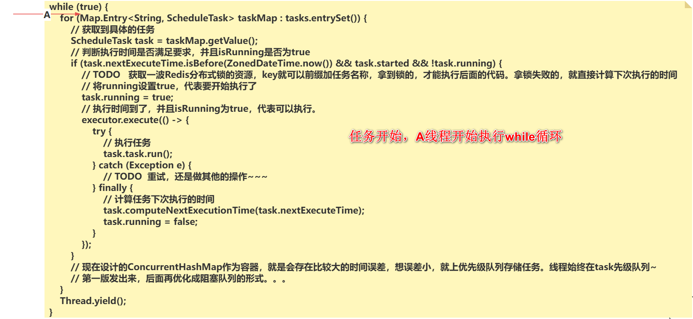
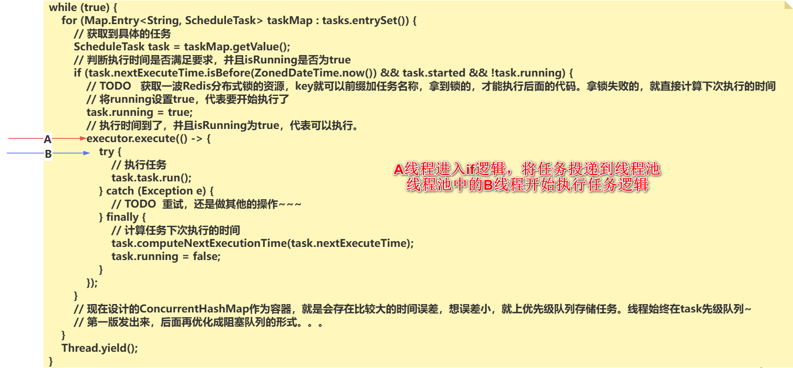
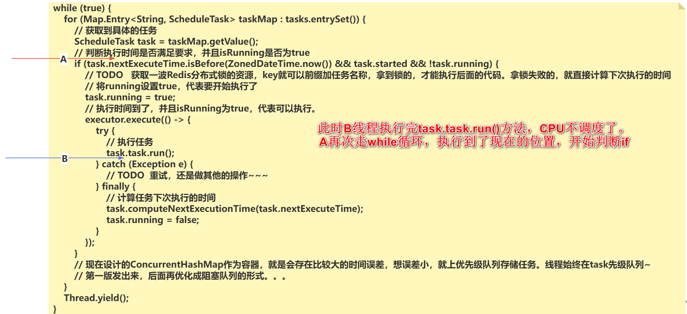
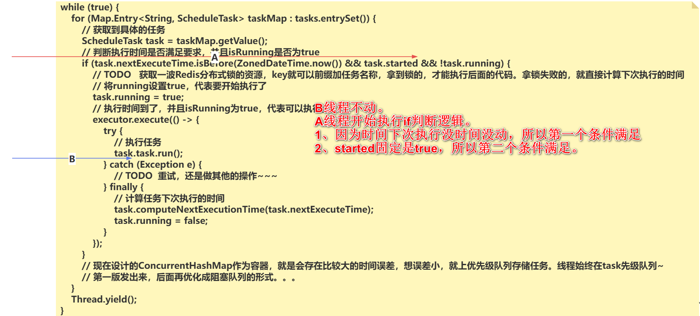
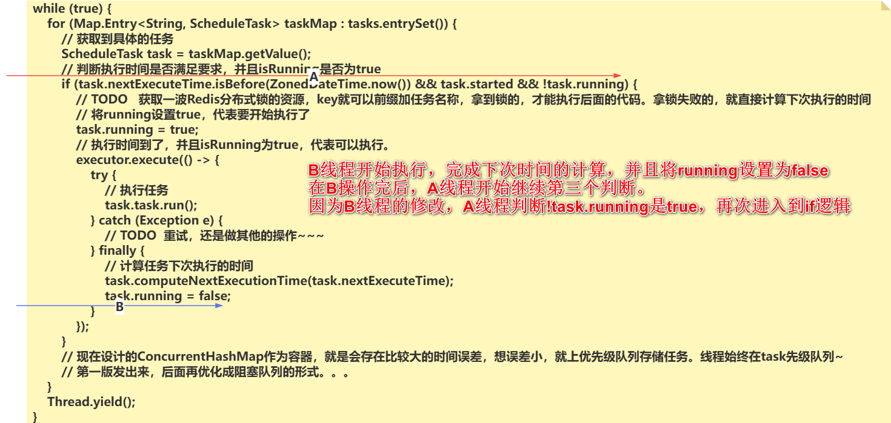
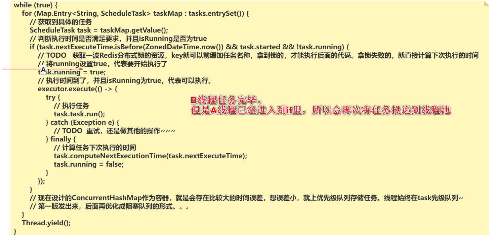

# **并发编程场景解决方案面试题**2025

## 1、设计一个异步任务执行框架，如何利用多线程来执行耗时的任务，并在任务完成后通知主线程（美团地图）

> 问的这个东西，其实Java中自带的工具已经实现了。利用CompletableFuture就可以实现这个效果，可以点一嘴CompletableFuture的一些API，证明你会。
>
> 比如CompletableFuture.supplyAsync知道好具体要执行的任务，然后在后续，追加一个thenApplyAsync，等任务完成后，执行thenApplyAsync的回调。
>
> 如果舍弃掉CompletableFuture，自己主动的去实现一个异步任务的执行框架，需要考虑哪些事情，怎么去落地实现。
>
> 1、优先构建好Java提供的线程池，ThreadPoolExecutor，用于多线程执行任务。
>
> 2、要求主动通知主线程，需要一个回调的函数，不能让主线程自己去get。针对回调函数，至少要提供成功与失败的方法。 onComplete，onError。
>
> 3、提供一个提交任务的方法，这个方法至少两个参数，一个是具体的任务Runnable，一个回调Callback。也可以提供一个执行Callable的提交任务的方法。
>
> 4、比如任务执行超时后，想要去走超时的回调，onTimeout啥的，直接在提交任务后面去追加。
>
> 5、比如任务执行一段时间后，要取消，一样可以提供任务的返回结果，让主线能拿到任务并且走cancel。
>
> ```java
> package org.example;
>
> import java.util.concurrent.*;
>
> /**
>  * 要自己设计的一个异步框架。
>  * 1、优先构建好Java提供的线程池，ThreadPoolExecutor，用于多线程执行任务。
>  *
>  * 2、要求主动通知主线程，需要一个回调的函数，不能让主线程自己去get。针对回调函数，至少要提供成功与失败的方法。 onComplete，onError。
>  *
>  * 3、提供一个提交任务的方法，这个方法至少两个参数，一个是具体的任务Runnable，一个回调Callback。也可以提供一个执行Callable的提交任务的方法。
>  */
> public class AsyncTaskFramework {
>
>     // 偷个懒，基于Executors先构建一个。。。
>     private final ExecutorService executor = Executors.newFixedThreadPool(10);
>
>     // 利用回调的方式，实现任务完成后，通知主线程。
>     private interface Callback{
>         default void onComplete(){};
>         default void onComplete(Object result){};
>         default void onError(Exception e){};
>         default void onTimeout(){}
>     }
>
>     /**
>      * 执行Runnable，提供callback的机制。
>      * @param task
>      * @param callback
>      */
>     public void submitTask(Runnable task, Callback callback){
>         // 提交任务到线程池时，自己写一套业务，确认可以在任务完成后，执行回调
>         executor.execute(() -> {
>             // 代码执行到这，已经是线程池里的线程在执行了，已经是异步的了。
>             try {
>                 // 执行任务
>                 task.run();
>                 // 任务执行完毕，没出现异常
>                 if(callback != null){
>                     callback.onComplete();
>                 }
>             } catch (Exception e) {
>                 if(callback != null){
>                     callback.onError(e);
>                 }
>             }
>         });
>     }
>
>     /**
>      * 执行Callable，提交callback回调。
>      * @param task
>      * @param callback
>      */
>     public void submitTask(Callable task, Callback callback){
>         executor.execute(() -> {
>             try {
>                 Object result = task.call();
>                 if(callback != null){
>                     callback.onComplete(result);
>                 }
>             } catch (Exception e) {
>                 if(callback != null){
>                     callback.onError(e);
>                 }
>             }
>         });
>     }
>
>     /**
>      * 追加超时的逻辑
>      * @param task
>      * @param callback
>      * @param timeout
>      * @param unit
>      */
>     public void submitTask(Runnable task, Callback callback, long timeout, TimeUnit unit){
>         Future<?> future = executor.submit(() -> {
>             try {
>                 task.run();
>             } catch (Exception e) {
>                 if (callback != null){
>                     callback.onError(e);
>                 }
>             }
>         });
>         // 判断超时与否
>         try {
>             future.get(timeout, unit);
>             // 成功的逻辑
>             if(callback != null){
>                 callback.onComplete();
>             }
>         } catch (TimeoutException e) {
>             // 超时的逻辑
>             if(callback != null){
>                 callback.onTimeout();
>             }
>         }catch (InterruptedException | ExecutionException e) {
>             // 异常的逻辑
>             if(callback != null){
>                 callback.onError(e);
>             }
>         }
>     }
>
>     public static void main(String[] args) {
>         AsyncTaskFramework framework = new AsyncTaskFramework();
>         framework.submitTask(() -> {
>
>             System.out.println("异步执行：xxxxx");
>             int i = 1 / 0;
>         }, new Callback() {
>             @Override
>             public void onComplete() {
>                 System.out.println("主线程在任务完毕后的回调");
>             }
>
>             @Override
>             public void onError(Exception e) {
>                 System.out.println("任务执行出现异常，通知主线程。");
>             }
>         });
>     }
>
> }
>
> ```

## 2、设计一个后台任务调度系统，如何利用多线程来并行执行多个定时任务，提高任务的处理效率（滴滴司乘）

> 后台调度就是一个定时任务的套路。
>
> 正常咱们很少自己去写这种东西，市面上开源好用的很多，比如单体上Quartz，分布式微服务的环境下，可以上Elastic-Job，XXL-Job等等…………开源定时任务框架非常非常多。。。
>
> 如果要自己设计的话，可以参考这个开源的框架去自己实现一套，造个轮子。
>
> 1、首先第一点，自己设计的定时任务框架要支持cron表达式，为了解析cron表达式，可以先导入一个cron-utils的小工具，来解析cron表达式。
>
> 2、其次构建好Java提供的线程池，ThreadPoolExecutor，用于多线程执行多个定时任务。
>
> 3、另外，这种基于cron的定时任务，单纯的Runnable没有办法支撑。自己要封装一个任务类。
>
> 4、因为是定时任务框架，任务要以周期性执行，需要有一个容器可以把任务存储起来，而且涉及到多个任务，所以需要一个线程安全的容器，直接上ConcurrentHashMap。
>
> 5、可以给当前任务调度框架添加上移除任务和添加任务的功能，暂停任务和启动任务的功能，还有立即执行。
>
> 6、在定时任务框架开始的时候，就直接要在一个死循环里遍历ConcurrentHashMap中的任务，查询每一个任务是否现在可以执行，可以就直接执行，不可以就拉倒。直到遍历结束，再开启下一次循环~。
>
> **优先把上述基本的功能实现，先发版，再迭代！！！！**
>
> 7、支持分布式锁，还需要考虑在任务执行前，获取一下Redis的分布式锁，确保就一个服务执行……
>
> 8、日志，任务失败的重试等等…………
>
> ```xml
> <dependencies>
>     <dependency>
>         <groupId>org.springframework.boot</groupId>
>         <artifactId>spring-boot-starter-web</artifactId>
>     </dependency>
>     <dependency>
>         <groupId>com.cronutils</groupId>
>         <artifactId>cron-utils</artifactId>
>         <version>9.2.0</version>
>     </dependency>
>     <dependency>
>         <groupId>org.projectlombok</groupId>
>         <artifactId>lombok</artifactId>
>     </dependency>
> </dependencies>
> ```
>
> ```java
> package org.example;
>
> import com.cronutils.model.Cron;
> import com.cronutils.model.CronType;
> import com.cronutils.model.definition.CronDefinition;
> import com.cronutils.model.definition.CronDefinitionBuilder;
> import com.cronutils.model.time.ExecutionTime;
> import com.cronutils.parser.CronParser;
> import lombok.extern.slf4j.Slf4j;
> import org.apache.logging.log4j.message.AsynchronouslyFormattable;
>
> import java.time.ZonedDateTime;
> import java.util.Map;
> import java.util.concurrent.ConcurrentHashMap;
> import java.util.concurrent.ExecutorService;
> import java.util.concurrent.Executors;
>
> /**
>  * 异步定时任务框架
>  * 1、首先第一点，自己设计的定时任务框架要支持cron表达式，为了解析cron表达式，可以先导入一个cron-util的小工具，来解析cron表达式。
>  *
>  * 2、其次构建好Java提供的线程池，ThreadPoolExecutor，用于多线程执行多个定时任务。
>  *
>  * 3、另外，这种基于cron的定时任务，单纯的Runnable没有办法支撑。自己要封装一个任务类。
>  *
>  * 4、因为是定时任务框架，任务要以周期性执行，需要有一个容器可以把任务存储起来，而且涉及到多个任务，所以需要一个线程安全的容器，直接上ConcurrentHashMap。
>  *
>  * 5、可以给当前任务调度框架添加上移除任务和添加任务的功能，暂停任务和启动任务的功能，还有立即执行。
>  *
>  * 6、在定时任务框架开始的时候，就直接要在一个死循环里遍历ConcurrentHashMap中的任务，查询每一个任务是否现在可以执行，可以就直接执行，不可以就拉倒。知道遍历结束。
>  */
> @Slf4j
> public class AsyncScheduleFramework {
>     // 偷个懒，基于Executors先构建一个。。。
>     private final ExecutorService executor = Executors.newFixedThreadPool(20);
>     // 任务需要容器存储，声明CHM
>     private final Map<String,ScheduleTask> tasks = new ConcurrentHashMap<>();
>
>     private static class ScheduleTask{
>         // 具体的任务
>         private Runnable task;
>         // 下次什么时间执行
>         ZonedDateTime nextExecuteTime;
>         // 计算下次执行时间的对象
>         ExecutionTime executionTime;
>         // 任务是否开启了可以执行的权限！！
>         volatile boolean started = true;
>         // 任务重复执行，第一次确保running为false，才能去执行，在执行前，将running改为true，在执行执行完毕后，再将任务修改为false
>         volatile boolean running = false;
>
>         public ScheduleTask(Runnable task, ZonedDateTime nextExecuteTime,ExecutionTime executionTime) {
>             this.task = task;
>             this.nextExecuteTime = nextExecuteTime;
>             this.executionTime = executionTime;
>         }
>
>         // 计算下次执行的时间。
>         void computeNextExecutionTime(ZonedDateTime nextExecuteTime) {
>             this.nextExecuteTime = executionTime.nextExecution(nextExecuteTime).get();
>         }
>     }
>
>     /**
>      * 添加任务。
>      * @param taskName  任务标识，方便后期对任务做启动，停止等操作。
>      * @param cronExpression  cron表达式
>      * @param task  具体任务
>      */
>     public void addTask(String taskName,String cronExpression,Runnable task){
>         // 1、 创建解析cron表达式的对象
>         CronParser parser = new CronParser(CronDefinitionBuilder.instanceDefinitionFor(CronType.QUARTZ));
>         // 2、 解析cron表达式
>         Cron cron = parser.parse(cronExpression);
>         // 3、将解析后的cron表达式转换为ExecutionTime
>         ExecutionTime executionTime = ExecutionTime.forCron(cron);
>         // 4、基于executionTime获取到下次任务要执行的时间。而且获取到的时间，最好是java.time下的类。
>         ZonedDateTime nextExecutionTime = executionTime.nextExecution(ZonedDateTime.now()).get();
>         // 5、创建任务对象
>         ScheduleTask scheduleTask = new ScheduleTask(task,nextExecutionTime,executionTime);
>         // 6、任务添加到ConcurrentHashMap
>         // TODO （这里要注意一下，先确保内部没有，咱们再put，忽然会覆盖。）
>         tasks.put(taskName,scheduleTask);
>     }
>
>     /**
>      * 任务启动
>      * @param taskName
>      */
>     public void start(String taskName){
>         ScheduleTask scheduleTask = tasks.get(taskName);
>         if(scheduleTask != null){
>             scheduleTask.started = true;
>         }
>     }
>     /**
>      * 任务暂停
>      * @param taskName
>      */
>     public void stop(String taskName){
>         ScheduleTask scheduleTask = tasks.get(taskName);
>         if(scheduleTask != null){
>             scheduleTask.started = false;
>         }
>     }
>
>     public AsyncScheduleFramework(){
>         // 在这个框架创建出来的时候，就开始遍历tasks集合，拿到任务就判断是否到了执行时间，并且isRunning为true，才可以执行。
>         Thread t = new Thread(() -> {
>             while(true){
>                 for (Map.Entry<String, ScheduleTask> taskMap : tasks.entrySet()) {
>                     // 获取到具体的任务
>                     ScheduleTask task = taskMap.getValue();
>                     // 判断执行时间是否满足要求，并且isRunning是否为true
>                     if(task.nextExecuteTime.isBefore(ZonedDateTime.now()) && task.started && !task.running){
>                         // TODO   获取一波Redis分布式锁的资源，key就可以前缀加任务名称，拿到锁的，才能执行后面的代码。拿锁失败的，就直接计算下次执行的时间
>                         log.info("各种日志，当前服务的标识，具体的任务名是啥，等等……");
>                         // 将running设置true，代表要开始执行了
>                         task.running = true;
>                         // 执行时间到了，并且isRunning为true，代表可以执行。
>                         executor.execute(() -> {
>                             try {
>                                 // 执行任务
>                                 task.task.run();
>
>                             } catch (Exception e){
>                                 // TODO  重试，还是做其他的操作~~~
>                             }finally {
>                                 // 计算任务下次执行的时间
>                                 task.computeNextExecutionTime(task.nextExecuteTime);
>                                 task.running = false;
>                             }
>                         });
>                     }
>                     // 现在设计的ConcurrentHashMap作为容器，就是会存在比较大的时间误差，想误差小，就上优先级队列存储任务。线程始终在task先级队列~
>                     // 第一版发出来，后面再优化成阻塞队列的形式。。。
>                 }
>                 Thread.yield();
>             }
>         });
>         t.start();
>     }
>
>     /**
>      * 第一版有点小bug，咱们没排查出来~~~
>      * @param args
>      */
>     public static void main(String[] args) {
>         AsyncScheduleFramework framework = new AsyncScheduleFramework();
>         framework.addTask("test","0/5 * * ? * *",() -> {
>             System.out.println(Thread.currentThread().getName() + "任务执行啦，时间：" + ZonedDateTime.now());
>         });
>     }
>
>     /*
>      * 1、 首先new  AsyncScheduleFramework，就会开启一个线程，去遍历ConcurrentHashMap
>      * 获取到里面存储的任务
>      * 拿到任务后先判断任务的执行时间是否到了 && 判断任务现在是否开启  && 任务是第一次在定时任务执行
>      * 在内部准备开始执行任务。
>      *      1.1 先将第一次任务执行的标识修改掉，确保只执行一次。
>      *      1.2 开启一个线程开始执行任务 ---  任务执行完毕，计算下次执行任务的时间，并且将第一次任务执行的标识重置
>      *
>      * 2、添加任务时的操作。
>      * 基于cron表达式，计算出这个任务下次执行的时间
>      * 封装ScheduleTask任务，并且将任务添加到ConcurrentHashMap集合里。
>      */
>
> }
>
> ```

## 第二题当时的问题解决

> 直接画图说了。
>
> 
>
> ---
>
> 
>
> ---
>
> 
>
> ---
>
> 
>
> ---
>
> 
>
> ---
>
> 
>
> 这样问题就出现了，所以解决问题的方式很简单，把判断的顺序更改一下就可以了。
>
> 将这个顺序
>
> ```java
> if (task.nextExecuteTime.isBefore(ZonedDateTime.now()) && task.started && !task.running) {
> ```
>
> 修改为
>
> ```java
> if (!task.running && task.started && task.nextExecuteTime.isBefore(ZonedDateTime.now())) {
> ```
>
> 这样再走上述的逻辑，就不会出现重复执行任务的问题。
>
> 只要线程池的线程没有执行完毕task.running = false，就不会进入到if的逻辑，哪怕出现了上述图中的逻辑，也会基于时间的第三个判断，进不去if，规避重复问题。

## 3、描述如何使用多线程来处理大数据集，例如在数据分析应用中，将数据拆分成多个部分并行处理（58同城）

> 这里最基本的线程池 + CountDownLatch就可以解决，至于代码实现。
>
> 核心思路自然就将大数据集拆分成多个部分，分别交给线程池去处理，等到所有任务才完成后，汇总即可。
>
> 实现部署步骤，大致分为几步：
>
> * 首先需要将大数据集拆分成若干部分，比如数据体量在1000W，那可以将每个任务拆分成100W，分别交给线程去处理。
> * 还需要计算好任务的个数，利用CountDownLatch来做计数器，确保得知任务是否全部完成。
> * 讲封装好的任务投递到线程池中执行。
> * 主线程等待任务完毕后，拿到每一个结果进行汇总即可。
>
> 这里有几个小细节需要考虑。
>
> * 首先是任务的切分，这里需要根据任务的情况来考虑
>   * 如果分析是单纯的CPU密集任务，那需要跟CPU内核个数考虑好，做好测试，如果并行的线程出太多，导致线程的上下文切换，会带来一定的性能损耗。
>   * 如果分析是IO密集的任务，这种IO密集的任务，线程数需要的数量会大一些，这里具体的线程数需要通过压测去测试，其次如果是JDK21版本，可以考虑引入虚拟线程来提升处理的效率。
> * 另外就是这种大规模的数据集，JVM内存是否能够一次性装下，如果在内存无法满足一次性获取时，需要做好分批次的处理流程。
> * 另外如果数据集的处理之前存在一些前后相互依赖的关系时，做好同步操作的事情，最好的方式，是利用CompletableFuture做好任务的编排工作。
> * 还有就是这种异步处理，咱们需要考虑可能存在一些异常问题，提前添加好处理异常的逻辑，出现问题时，要有一个补偿的措施。

## 4、描述如何实现一个网络爬虫，利用多线程并行抓取多个网页，提高数据抓取的效率（百度AI）

> 咱们面的是Java岗位，别一看爬虫就想Python，首先Python爬数据，确实比Java好，但是Java也能抓一些数据的。
>
> 爬取数据的整体过程，无非是获取对应的URL，访问URL获取对应的响应信息，Java就是利用Jsoup提供的API对数据进行解析，拿到对应的数据，落库即可。
>
> 影响抓取数据效率的位置：
>
> * 访问URL的过程。网络IO的时间成本高。
> * 利用Jsoup去解析数据时，如果单个URL反馈的数据体量太大，串行解析的成本比较高。
> * URL可能重复，重复获取或者解析数据
> * URL体量比较大，每次解析完都单独落库的话，对应MySQL的压力不小，而且多次找MySQL的网络IO，磁盘IO成本都很高。
>
> 问题有了，解决起来就方便了。
>
> * 解决URL的网络IO成本，那就是直接线程池并行去访问URL，避免单个线程阻塞长时间等待。多个线程并行去访问URL。
> * 每个线程在获取的URL之后，根据单个URL的数据体量考虑，是否需要多个线程并行的利用Jsoup去解析，这里属于CPU密集的业务类型，线程个数不宜太高，当然如果单个URL数据体量不大，这里不需要并行去解析。
> * 可以在获取URL之后，甚至是发起请求到URL前，先利用Redis或者本地的CHM，确保访问一次即可，减少重复访问的问题。
> * 可以让每个解析完数据的线程，将数据扔到一个阻塞队列里，当数据个数达到一定程度，比如500，比如1000等等，根据具体的情况，做批量入库操作。
>
> 还可以再考虑点事：
>
> * 做过爬虫的同学们都知道，不能随便爬，最好看看平台提供的rebots文件，确保满足对方的协议。。。
> * 毕竟是爬数据嘛，请求的体量不要太大，避免人家有反扒机制，封你IP，不过封IP也不怕，咱们可以上代理高动态IP。
> * 比如访问URL失败，做好重试或者是记录的一些操作。

## 5、描述如何在Java应用中使用多线程执行数据库的批量插入或更新操作，以提高数据库的写入效率（猫眼）

> 核心就是任务划分，多线程并行执行批量插入操作。
>
> 1、你需要根据你的数据集大小以及系统资源情况来合理的划分任务。比如你有10W的数据需要插入，咱们每个线程批量插入1000条数据，那就可以家境任务拆分成100份，让每个线程每次批量插入1000条数据即可。
>
> 2、准备线程池，内部的线程个数要根据MySQL服务器那边的系统资源考虑，插入操作IO涉及的多一些，CPU资源还好，内存资源和连接数需要重点考虑。
>
> 可以提前测试批量插入，查看一下MySQL所在服务的负载情况，主要查看越好CPU和内存的资源，不要达到太高的负载。。
>
> 3、同样，Java端也需要考虑好线程池中的资源，比如阻塞队列，数据体量如果太大，内存能否抗住。线程数也要考虑好CPU的资源情况。
>
> 一样，也是要做好压测的事情。
>
> 4、准备好线程池，准备好任务，干活！！！！
>
> ---
>
> 毕竟批量跟数据库操作，而且是多线程，需要考虑好死锁的问题。
>
> 建议事务的隔离级别，上read committed。可以规避掉好多修改和插入并行的死锁问题。。。
